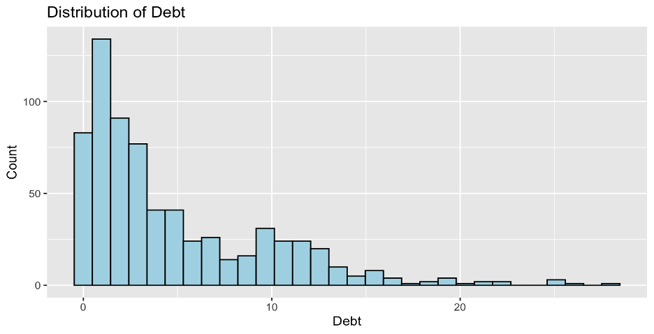
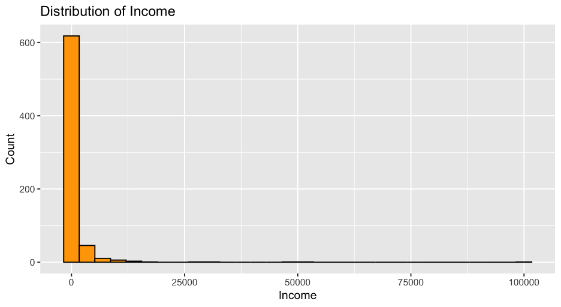
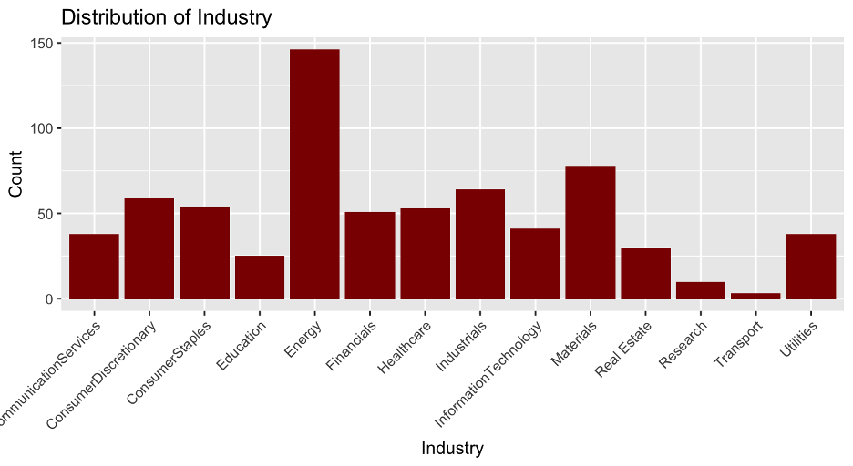

# 💳 Credit Card Approval – Exploratory Data Analysis (EDA)

## 📌 Project Overview
This project presents an exploratory data analysis of a credit card approval dataset, completed as part of **CIS 468 – Applied Data Science and Machine Learning** at Towson University.

The objective is to understand the structure of the dataset, evaluate the distribution of financial variables, and explore relationships between applicant characteristics and credit approval outcomes.

---

## 🎯 Objectives
- Analyze the distribution of financial variables such as **Debt, Income, and Credit Score**
- Identify **skewness, outliers, and variability** in the dataset
- Explore relationships between numeric variables and approval outcomes
- Examine how **categorical factors (e.g., Industry)** influence approval decisions
- Provide insights to support future predictive modeling

---

## 📊 Dataset Overview

## 📈 Key Visualizations

### Approval Distribution

> The dataset contains slightly more denied applications than approved ones, showing a mildly imbalanced outcome distribution.

### Debt Distribution

> Debt is right-skewed, with most applicants having relatively low debt and a smaller number showing much higher values.

### Income Distribution

> Income is extremely right-skewed, with a few large outliers pulling the distribution far to the right.

### Credit Score Distribution
.png?raw=true)

> Credit scores are heavily concentrated near zero, suggesting that many applicants have limited or no recorded credit history.

### Debt vs Approval
.png?raw=true)

> Debt distributions overlap substantially between approved and denied applicants, indicating that debt alone does not explain approval outcomes.

### Income vs Debt
.png?raw=true)

> The relationship between income and debt is weak, with a low positive correlation and substantial dispersion across observations.

### Industry Distribution

> Applicant counts vary across industries, with some sectors more heavily represented in the dataset than others.

### Industry vs Approval
.png?raw=true)

> Approval outcomes vary by industry, suggesting that categorical factors may contribute to differences in approval patterns.

---

## 🛠️ Methods

The analysis was conducted using **R (ggplot2)** and focused on descriptive and visual exploration.

### Techniques Used
- Descriptive statistics (mean, median, variance, skewness)
- Histograms and boxplots for distribution analysis
- Scatter plots with regression lines
- Pearson correlation analysis
- Group comparisons using bar charts and boxplots

### Analytical Decisions
- Boxplots were preferred over Z-score methods due to skewed distributions  
- Q-Q plots were considered but not used, as histograms revealed strong non-normality  
- Correlation and regression were interpreted cautiously due to outliers  

---

## 🔍 Key Findings
- Financial variables are **heavily right-skewed**
- Mean values are influenced by extreme outliers  
- Income and debt show a **weak relationship**  
- Approval outcomes are not explained by a single variable  
- Industry appears to influence approval patterns  

---

## ⚠️ Limitations
- Strong skewness violates normality assumptions  
- Extreme outliers affect statistical interpretation  
- Some variables show **zero-inflation** (e.g., Credit Score)  
- Analysis is descriptive, not predictive  

---

## 🚀 Future Work
- Apply transformations to handle skewness  
- Build predictive models (Logistic Regression, Decision Trees)  
- Evaluate fairness and bias in approval decisions  

---

## 📂 Project Structure
credit-card-approval-eda/
│── data/
│── scripts/
│── visualizations/
│── presentation/
│── report/
│── README.md

---

## 📊 Presentation
A presentation was created to communicate key findings and analytical insights:

[📥 Download Presentation (PPTX)](https://raw.githubusercontent.com/niranjanKC-analytics/credit-card-approval-eda/main/presentation/Credit_Card_Approval_EDA_Niranjan.pptx)

---

## 📄 Full Report
A detailed written report includes methodology, statistical analysis, and interpretation:

➡️ [📄 Download Full Report (DOCX)](https://raw.githubusercontent.com/niranjanKC-analytics/credit-card-approval-eda/main/report/Assignment1_EDA_KC.docx)

---
## 💻 Code Implementation

The full data analysis workflow is implemented in R, including data cleaning, visualization, and statistical analysis.

👉 [View R Script](https://github.com/niranjanKC-analytics/credit-card-approval-eda/blob/main/scripts/Assignment1_EDA_KC.R)

---
## 🧰 Tools & Technologies
- R
- ggplot2
- Data Visualization
- Statistical Analysis

---

## 📚 References
- Kaggle. Credit Card Approval Dataset  
  https://www.kaggle.com/datasets/samuelcortinhas/credit-card-approval-clean-data  
- CIS 468 Course Materials – Towson University  

---

## 👤 Author
**Niranjan K C**  
Information Technology Student – Towson University  
Aspiring Data Analyst / Data Scientist
